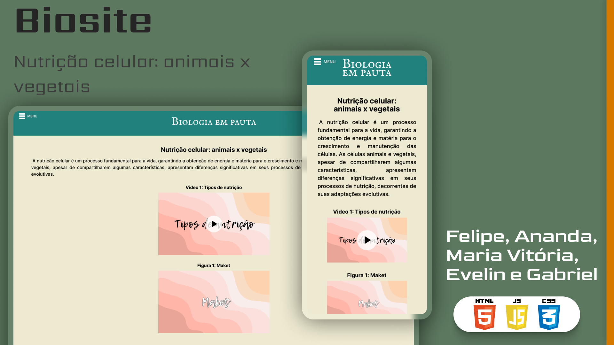

<h1 align="center"> Biosite </h1>

Projeto de biologia e autoria web, desenvolvido por: Ananda, Evelin, Felipe, Gabriel Pinheiro e Maria Vitória.  

  <a href="#tecnologias">Tecnologias</a>&nbsp;&nbsp;&nbsp;|&nbsp;&nbsp;&nbsp;
  <a href="#projeto">Projeto</a>&nbsp;&nbsp;&nbsp;|&nbsp;&nbsp;&nbsp;
  <a href="#layout">Layout</a>&nbsp;&nbsp;&nbsp;|&nbsp;&nbsp;&nbsp;
<a href="#desenvolvedores">Desenvolvedores</a>

 

  

## Tecnologias

Esse projeto foi desenvolvido com as seguintes tecnologias:

- HTML;
- CSS;
- JavaScript;
- Git;
- Github;
- Figma.

## Projeto

O Biosite é um projeto das disciplinas de biologia e autoria web, que aborda a nutrição das células animais e vegetais.

- [Acesse o projeto finalizado, online](https://felipemacedo10.github.io/Biosite/)

## Layout

Você pode visualizar o layout do projeto através [DESSE LINK](https://www.figma.com/design/vKykUJRRhmymg3kTvexbWK/Biosite-(Felipe%2C-Ananda%2C-Maria-Vit%C3%B3ria%2C-Evelin-e-Gabriel).?node-id=10-620&t=VZTCl1xSCvTuOT8g-1). É necessário ter conta no [Figma](https://figma.com) para acessá-lo.

## Desenvolvedores

Ananda, Evelin, Felipe, Gabriel Pinheiro e Maria Vitória.
